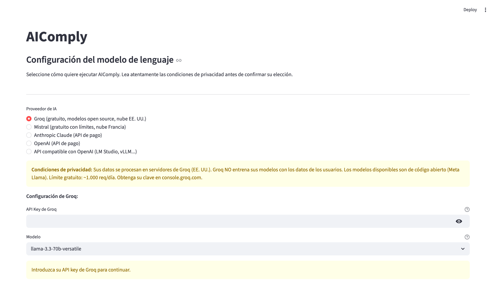

# AIComply

[](https://github.com/ComunidadIA-OS/aicomply/actions/workflows/tests.yml)
[](https://opensource.org/licenses/Apache-2.0)
[](https://www.python.org/)
[](https://streamlit.io/)

**Asistente conversacional en español para evaluar el cumplimiento de sistemas de IA con el AI Act europeo (Reglamento UE 2024/1689), orientado a PYMEs industriales.**

Compatible con **Anthropic Claude**, **OpenAI**, **Ollama** (modelos locales) y cualquier **API compatible con OpenAI** (LM Studio, vLLM, Groq, Together AI, Mistral API...).

---

> **AVISO LEGAL:** AIComply es una herramienta auxiliar de orientación. Los resultados no constituyen asesoramiento legal. Se recomienda consultar con especialistas antes de tomar decisiones de cumplimiento normativo.

---

## Descripción

AIComply guía a PYMEs industriales a través de tres fases secuenciales:

1. **Evaluador y clasificador** — Árbol de decisión conversacional basado en el Reglamento (UE) 2024/1689 que determina el nivel de riesgo del sistema (PROHIBIDO, ALTO, LIMITADO o MÍNIMO) y el rol de la organización (proveedor, implementador, distribuidor, importador). Soporta múltiples roles simultáneos.

2. **Análisis de cumplimiento** — Una vez clasificado el sistema, el asistente recorre las obligaciones concretas aplicables según el nivel de riesgo y el rol, detectando cuáles están cubiertas, cuáles parcialmente y cuáles son áreas de mejora pendientes.

3. **Informe** — Genera tres tipos de informe exportables en PDF y texto plano: solo clasificación, solo cumplimiento, o informe completo. Los informes incluyen un plan de acción priorizado y los puntos que requieren revisión profesional.

## Capturas de pantalla

### Pantalla de configuración y selección de provider



### Pestaña Evaluador — árbol de decisión conversacional


### Resultado de la clasificación


### Informe de cumplimiento exportado en PDF


---

## Corpus normativo

El RAG (Retrieval-Augmented Generation) de AIComply incluye **27 documentos** con más de **280 fragmentos** indexados:

| Fuente | Documentos |
|--------|-----------|
| Reglamento (UE) 2024/1689 — AI Act completo | 1 |
| Reglamento Ómnibus (modificaciones sectoriales) | 1 |
| Anteproyecto de Ley española de IA (gobernanza y régimen sancionador) | 1 |
| Guías oficiales de la AESIA (16 guías + checklist) | 17 |
| GDPR / AEPD — adecuación, IA agéntica, auditorías | 4 |
| Directrices de la Comisión Europea sobre alto riesgo — borrador 19 mayo 2026 (principios generales, Anexo I, Anexo III) | 3 |

Para añadir nuevos documentos al corpus, consulte la sección [Ingesta de documentos](#ingesta-de-documentos).

## Artículos del AI Act cubiertos

| Artículo | Título | Aplica a |
|----------|--------|----------|
| Art. 4 | Alfabetización en materia de IA | Todos |
| Art. 5 | Prácticas prohibidas | Todos |
| Art. 6 | Clasificación de sistemas de alto riesgo | Todos |
| Art. 9 | Sistema de gestión de riesgos | Alto riesgo |
| Art. 10 | Datos y gobernanza de datos | Alto riesgo |
| Art. 11 | Documentación técnica (Anexo IV) | Alto riesgo |
| Art. 12 | Conservación de registros (logs) | Alto riesgo |
| Art. 13 | Transparencia e instrucciones de uso | Alto riesgo |
| Art. 14 | Supervisión humana | Alto riesgo |
| Art. 15 | Exactitud, solidez y ciberseguridad | Alto riesgo |
| Art. 16 | Obligaciones del proveedor | Alto riesgo — Proveedor |
| Art. 17 | Sistema de gestión de la calidad | Alto riesgo — Proveedor |
| Art. 22 | Representantes autorizados | Alto riesgo — Proveedor no-UE |
| Art. 23 | Obligaciones de los importadores | Alto riesgo — Importador |
| Art. 24 | Obligaciones de los distribuidores | Alto riesgo — Distribuidor |
| Art. 25 | Responsabilidades en la cadena de valor | Alto riesgo |
| Art. 26 | Obligaciones del responsable del despliegue | Alto riesgo — Implementador |
| Art. 27 | Evaluación de impacto sobre derechos fundamentales | Alto riesgo — Sector público |
| Art. 43 | Evaluación de conformidad | Alto riesgo — Proveedor |
| Art. 47 | Declaración UE de conformidad | Alto riesgo — Proveedor |
| Art. 48 | Marcado CE | Alto riesgo — Proveedor |
| Art. 49 | Registro en la base de datos de la UE | Alto riesgo |
| Art. 50 | Obligaciones de transparencia (chatbots, deepfakes) | Riesgo limitado |
| Art. 72 | Supervisión poscomercialización | Alto riesgo — Proveedor |
| Art. 95 | Códigos de conducta voluntarios | Riesgo mínimo |

## Configuración del modelo de lenguaje

AIComply incluye una pantalla de configuración inicial donde puede elegir su proveedor de IA con información clara sobre las implicaciones de privacidad de cada opción.

### Tabla comparativa de privacidad

| Provider | Plan | Datos en servidores de terceros | Uso para entrenamiento | Recomendado para |
|----------|------|---------------------------------|------------------------|------------------|
| Ollama (local) | Gratuito | No — todo local | No | Documentación confidencial, máxima privacidad |
| LM Studio / vLLM | Gratuito | No — todo local | No | Documentación confidencial, máxima privacidad |
| Anthropic Claude | API Enterprise | Sí (EE. UU.) | No | Documentación empresarial confidencial |
| Anthropic Claude | API de pago | Sí (EE. UU.) | No | Uso empresarial general |
| OpenAI | ChatGPT Enterprise | Sí (EE. UU.) | No | Documentación empresarial confidencial |
| OpenAI | API de pago Tier 1+ | Sí (EE. UU.) | No por defecto | Uso empresarial, revisar DPA |
| Groq / Together AI | API externa | Sí (terceros) | Revisar política | Uso general sin datos sensibles |
| OpenAI | Cuenta gratuita | Sí (EE. UU.) | **Sí** | **No recomendado para datos confidenciales** |

### Configuración via .env (despliegues fijos)

Copie `.env.example` a `.env` y configure el provider deseado:

**Ollama (recomendado para demo y datos sensibles):**
```bash
LLM_PROVIDER=ollama
OLLAMA_MODEL=llama3
OLLAMA_BASE_URL=http://localhost:11434
```

**Anthropic Claude:**
```bash
LLM_PROVIDER=anthropic
ANTHROPIC_API_KEY=sk-ant-...
ANTHROPIC_MODEL=claude-sonnet-4-6
```

**LM Studio (local, gratuito):**
```bash
LLM_PROVIDER=openai_compatible
OPENAI_COMPATIBLE_BASE_URL=http://localhost:1234/v1
OPENAI_COMPATIBLE_MODEL=llama-3.1-8b-instruct
```

**Groq (servicio externo rápido):**
```bash
LLM_PROVIDER=openai_compatible
OPENAI_COMPATIBLE_BASE_URL=https://api.groq.com/openai/v1
OPENAI_COMPATIBLE_API_KEY=gsk_...
OPENAI_COMPATIBLE_MODEL=llama-3.1-70b-versatile
```

Si `LLM_PROVIDER` está vacío, la interfaz mostrará el selector interactivo en cada inicio.

## Instalación

### Requisitos previos

- Python 3.10 o superior
- Una fuente de LLM: API de Anthropic/OpenAI, Ollama instalado, o LM Studio

### Pasos

1. **Clonar el repositorio:**
   ```bash
   git clone https://github.com/ComunidadIA-OS/aicomply.git
   cd aicomply
   ```

2. **Crear y activar un entorno virtual:**
   ```bash
   python -m venv .venv
   source .venv/bin/activate    # Linux/macOS
   .venv\Scripts\activate       # Windows
   ```

3. **Instalar las dependencias:**
   ```bash
   pip install -e .
   # o alternativamente:
   pip install -r requirements.txt
   ```

4. **Configurar el provider (opcional):**
   ```bash
   cp .env.example .env
   # Edite .env con su configuración preferida
   ```
   Si no configura `.env`, la aplicación mostrará el selector interactivo.

5. **Ejecutar:**
   ```bash
   streamlit run app.py
   ```

### Inicio rápido con Ollama

```bash
# 1. Instalar Ollama
curl -fsSL https://ollama.ai/install.sh | sh   # Linux/macOS

# 2. Descargar un modelo
ollama pull llama3.1

# 3. Ejecutar AIComply
streamlit run app.py
```

## Uso

1. **Elija su provider** en la pantalla inicial y lea las condiciones de privacidad.
2. **Acepte el aviso legal.**
3. **Pestaña Evaluador:** Describa su sistema de IA respondiendo las preguntas del asistente. Cuando el árbol de decisión concluya, pulse "Completar evaluación".
4. **Pestaña Cumplimiento:** El asistente recorre las obligaciones aplicables. Indique qué tiene implementado y qué no. Cuando termine, pulse "Finalizar análisis".
5. **Pestaña Informe:** Genere y descargue el informe en PDF o texto plano (clasificación, cumplimiento, o completo).

## Ingesta de documentos

Para añadir nuevos documentos legales al corpus del RAG, use el script incluido:

```bash
python scripts/ingest_txt.py ruta/al/documento.txt \
  --titulo "Título del documento" \
  --fuente "Organismo emisor" \
  --tipo guia_oficial \
  --fecha "2025-01-01" \
  --url "https://..."
```

Los tipos disponibles son: `ley_nacional`, `reglamento_ue`, `guia_oficial`, `directriz`, `documento_legal`.

El JSON resultante se guarda en `data/docs/` y es cargado automáticamente por el vectorstore en el próximo arranque. Los ficheros `.txt` originales no se suben al repositorio.

## Estructura del proyecto

```
aicomply/
├── app.py                              # Aplicación principal Streamlit
├── config.py                           # Configuración y constantes
├── pyproject.toml                      # Metadatos y dependencias del paquete
├── src/
│   ├── chatbot.py                      # Lógica de conversación con el LLM
│   ├── report_generator.py             # Generación de informes (PDF + texto)
│   ├── tabs/
│   │   ├── evaluador.py                # Pestaña 1: árbol de decisión
│   │   ├── cumplimiento.py             # Pestaña 2: análisis de obligaciones
│   │   └── informe.py                  # Pestaña 3: generación y descarga
│   ├── llm/
│   │   ├── provider.py                 # Clase abstracta LLMProvider
│   │   ├── anthropic_provider.py       # Implementación Anthropic Claude
│   │   ├── ollama_provider.py          # Implementación Ollama (local)
│   │   ├── openai_provider.py          # Implementación OpenAI-compatible
│   │   └── factory.py                  # Fábrica de providers
│   └── rag/
│       ├── vectorstore.py              # Vectorstore TF-IDF (sin FAISS)
│       └── retriever.py                # Recuperador de fragmentos relevantes
├── prompts/
│   ├── system_prompts.py               # Prompt del evaluador (árbol de decisión)
│   └── system_prompt_cumplimiento.py   # Prompt del análisis de cumplimiento
├── data/
│   ├── ai_act/
│   │   └── ai_act_articles.json        # 25 artículos del AI Act estructurados
│   └── docs/                           # Corpus adicional (27 documentos JSON)
├── scripts/
│   └── ingest_txt.py                   # Convierte .txt legales a JSON para el RAG
├── LICENSE
├── README.md
├── CONTRIBUTING.md
├── requirements.txt
├── .env.example
└── .gitignore
```

## Software preexistente y aportación original

AIComply se construye sobre librerías de código abierto preexistentes. La siguiente tabla distingue las dependencias externas de los componentes desarrollados específicamente para este proyecto:

| Componente | Origen | Descripción |
|-----------|--------|-------------|
| `streamlit` | Preexistente | Framework de interfaz web |
| `anthropic` SDK | Preexistente | Cliente oficial de la API de Anthropic |
| `openai` SDK | Preexistente | Cliente para APIs compatibles con OpenAI |
| `httpx` | Preexistente | Cliente HTTP para la API REST de Ollama |
| `scikit-learn` | Preexistente | Motor TF-IDF para el vectorstore |
| `fpdf2` | Preexistente | Generación de PDF |
| `python-dotenv` | Preexistente | Gestión de variables de entorno |
| Lógica de conversación (`src/chatbot.py`) | **Original** | Orquestación del flujo multi-fase con el LLM |
| Árbol de decisión AI Act (`src/tabs/evaluador.py`) | **Original** | Evaluación de riesgo basada en Art. 5, 6 y Anexo III |
| Análisis de cumplimiento (`src/tabs/cumplimiento.py`) | **Original** | Recorrido de obligaciones por rol y nivel de riesgo |
| Abstracción multi-provider (`src/llm/`) | **Original** | Clase abstracta + 4 implementaciones intercambiables |
| Vectorstore TF-IDF (`src/rag/`) | **Original** | Recuperación semántica sin dependencias de FAISS |
| Prompts de sistema (`prompts/`) | **Original** | Instrucciones especializadas para evaluador y cumplimiento |
| Corpus JSON del AI Act (`data/ai_act/`) | **Original** | 25 artículos estructurados con metadatos normativos |
| Corpus legal normalizado (`data/docs/`) | **Original** | 27 documentos legales convertidos a formato RAG |

## Stack tecnológico

| Componente | Tecnología |
|-----------|-----------|
| Interfaz | Streamlit |
| Abstracción LLM | `LLMProvider` (clase abstracta propia) |
| Anthropic Claude | `anthropic` SDK |
| Ollama / modelos locales | `httpx` (API REST de Ollama) |
| OpenAI y compatibles | `openai` SDK |
| RAG (recuperación) | TF-IDF con `scikit-learn` (sin FAISS) |
| Exportación PDF | `fpdf2` |
| Variables de entorno | `python-dotenv` |

## Hoja de ruta

### v1.x (en curso)
- [x] Árbol de decisión conversacional completo (Art. 5, 6, Anexo III)
- [x] Soporte multi-provider (Anthropic, OpenAI, Ollama, API compatible)
- [x] Arquitectura de tres pestañas con desbloqueo secuencial
- [x] Tres tipos de informe exportables (PDF + texto plano)
- [x] Soporte de múltiples roles simultáneos
- [x] 25 artículos del AI Act estructurados en el RAG
- [x] Corpus normativo completo: AESIA, Anteproyecto de Ley ES, GDPR/AEPD, directrices Comisión Europea
- [x] Tests unitarios para el árbol de decisión y el chatbot
- [ ] Flujo guiado para la Evaluación de Impacto sobre Derechos Fundamentales (Art. 27)
- [ ] Persistencia de evaluaciones — guardar y reanudar sesiones
- [ ] Mejora exportación PDF con fuente Unicode completa

### v2.x
- [ ] API REST para integración con CI/CD
- [ ] Soporte multiidioma (inglés, francés, alemán)
- [ ] Integración con el AI Office de la UE para actualizaciones normativas

## Contribuir

Las contribuciones son bienvenidas. Consulte [CONTRIBUTING.md](CONTRIBUTING.md) para las directrices de contribución, incluyendo cómo añadir nuevos providers de LLM.

## Recursos reutilizables para la comunidad

AIComply pone a disposición de la comunidad varios recursos que pueden reutilizarse de forma independiente en otros proyectos de cumplimiento normativo de IA:

### Corpus estructurado del AI Act (`data/ai_act/ai_act_articles.json`)

25 artículos del Reglamento (UE) 2024/1689 estructurados en JSON bajo licencia Apache 2.0, listos para ser consumidos por cualquier aplicación RAG, chatbot o motor de cumplimiento. Cada artículo incluye:

- `titulo`, `capitulo`, `nivel_riesgo`, `aplica_a`
- `texto_oficial` — texto íntegro del artículo
- `requisitos_clave` — lista de obligaciones concretas
- `palabras_clave` — etiquetas para recuperación semántica

Adicionalmente, el fichero incluye `categorias_alto_riesgo` con la taxonomía completa del Anexo III (sistemas de alto riesgo por sector).

Este dataset es, que sepamos, el primer corpus estructurado y reutilizable del AI Act disponible en español bajo licencia abierta.

### Corpus legal normalizado para RAG (`data/docs/`)

27 documentos legales (AI Act completo, guías AESIA, GDPR/AEPD, anteproyecto de Ley ES, directrices Comisión Europea) convertidos a JSON con metadatos homogéneos (`titulo`, `fuente`, `tipo`, `fecha`, `url`, `fragmentos`). Formato listo para indexar con cualquier vectorstore.

### Herramienta de ingesta de documentos legales (`scripts/ingest_txt.py`)

Script CLI reutilizable para convertir documentos legales en texto plano (.txt) al formato JSON normalizado del corpus. Útil para extender el corpus con nuevas guías, reglamentos o directrices sin modificar el código de la aplicación.

### Abstracción multi-provider de LLM (`src/llm/`)

Clase abstracta `LLMProvider` con implementaciones para Anthropic Claude, OpenAI y APIs compatibles (Groq, Mistral, LM Studio, vLLM) y Ollama (modelos locales). Permite cambiar de provider sin modificar la lógica de negocio. Reutilizable en cualquier aplicación Python que necesite independencia del proveedor de LLM.

## Licencia

Este proyecto está licenciado bajo la [Licencia Apache 2.0](LICENSE).

---

**AIComply es una herramienta auxiliar de orientación. Los resultados no constituyen asesoramiento legal. Se recomienda consultar con especialistas antes de tomar decisiones de cumplimiento normativo.**
