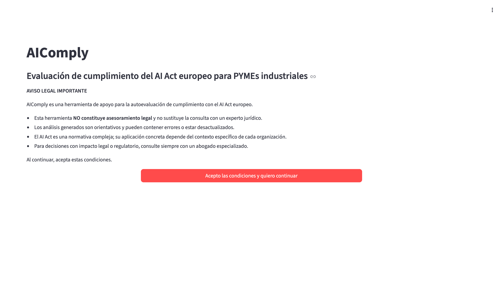
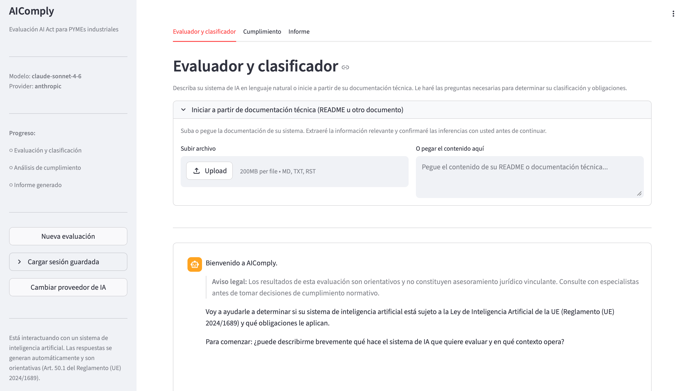
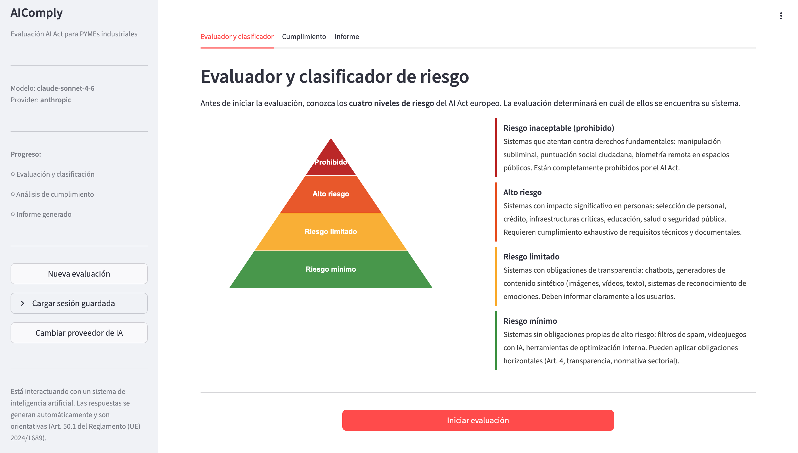
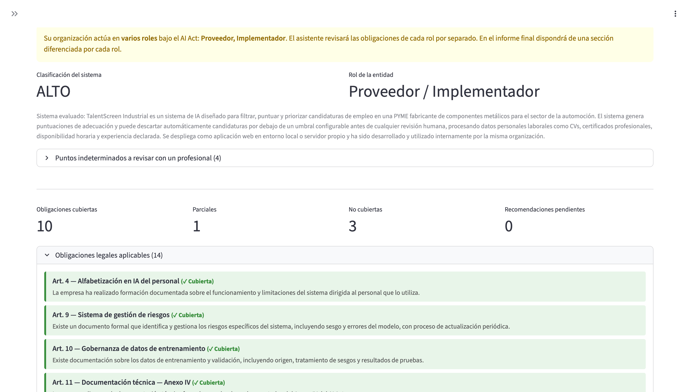
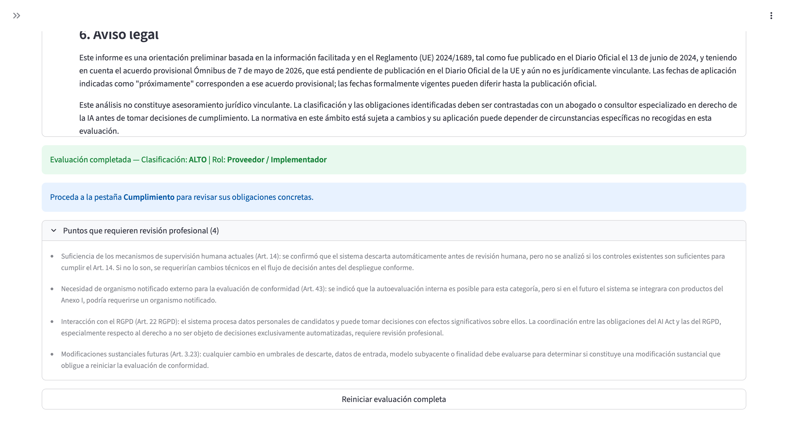
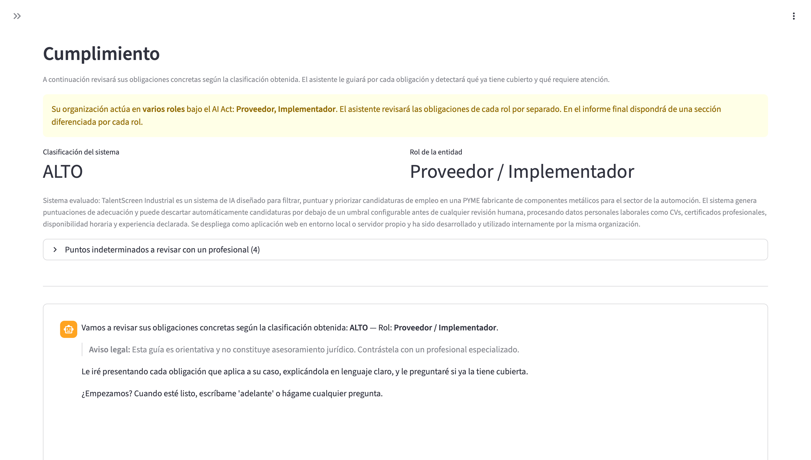
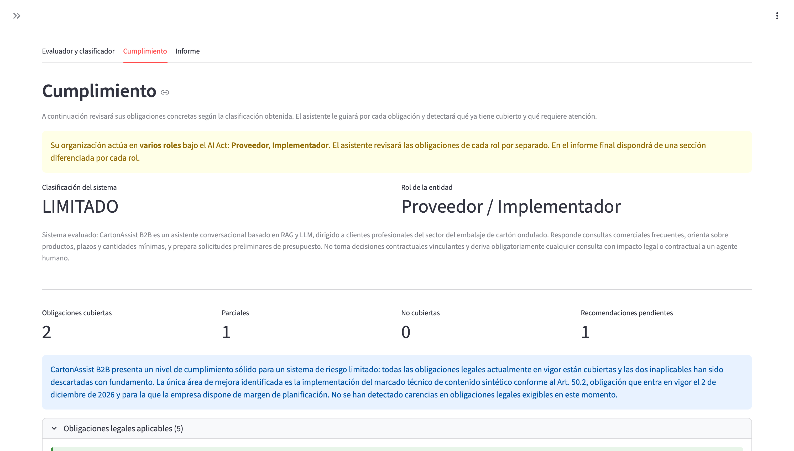
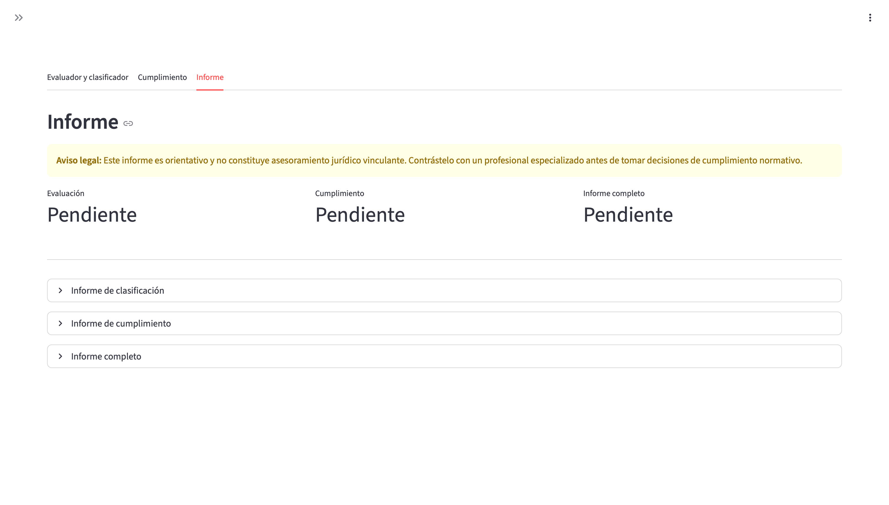
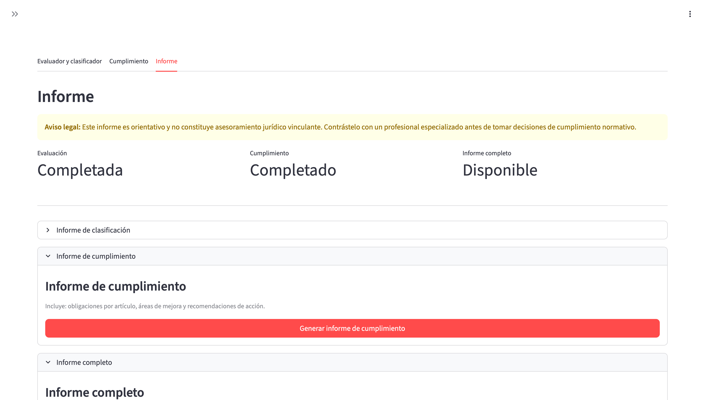

# AIComply

[](https://github.com/ComunidadIA-OS/aicomply/actions/workflows/tests.yml)
[](https://opensource.org/licenses/Apache-2.0)
[](https://www.python.org/)
[](https://streamlit.io/)

**Asistente conversacional en español para evaluar el cumplimiento de sistemas de IA con el AI Act europeo (Reglamento UE 2024/1689), orientado a PYMEs industriales.**

Compatible con **Anthropic Claude**, **OpenAI**, **Ollama** (modelos locales) y cualquier **API compatible con OpenAI** (LM Studio, vLLM, Groq, Together AI, Mistral API...).

---

> **AVISO LEGAL:** AIComply es una herramienta auxiliar de orientación. Los resultados no constituyen asesoramiento legal. Se recomienda consultar con especialistas antes de tomar decisiones de cumplimiento normativo.

---

## El problema

El AI Act europeo (Reglamento UE 2024/1689) es ya derecho vigente con un calendario escalonado. Las prácticas prohibidas (Art. 5) y la alfabetización en IA (Art. 4) aplican desde el **2 de febrero de 2025**; las reglas para modelos de IA de propósito general (GPAI, Arts. 51-55), desde el **2 de agosto de 2025**; las obligaciones de transparencia del **Art. 50** (chatbots, contenido sintético, deep fakes), desde el **2 de agosto de 2026**. El Ómnibus digital se adoptó como **Reglamento (UE) 2026/1744** y está en vigor desde el **27 de julio de 2026**: traslada las obligaciones de **alto riesgo del Anexo III** (empleo, servicios esenciales, biometría…) al **2 de diciembre de 2027** y las del **Anexo I** (productos regulados: maquinaria, vehículos, dispositivos médicos…) al **2 de agosto de 2028**. Son fechas firmes, no un calendario provisional. Las sanciones por incumplimiento alcanzan hasta **35 M€ o el 7% de la facturación global** (para una PYME con 2 M€ de facturación, el tope práctico son 140.000 €).

Con la entrada en vigor del Ómnibus se actualizan tanto las fechas que maneja la herramienta —centralizadas en [`data/calendario.json`](data/calendario.json)— como el corpus del RAG.

El problema es que el **41% de las PYMEs españolas ya usa IA de forma regular** (IONOS/YouGov, 2026) — la tasa más alta de Europa — pero la mayoría no sabe si sus sistemas están sujetos al reglamento, qué nivel de riesgo tienen ni qué obligaciones concretas les aplican. La asesoría legal especializada en AI Act tiene un coste prohibitivo para una PYME. Las herramientas existentes están en inglés, son cuestionarios estáticos o están diseñadas para grandes corporaciones.

**Escenario ilustrativo:** MECALSA S.L. (empresa representativa de PYME industrial), fabricante con 85 empleados, ha implantado un sistema de visión artificial para el control de calidad en línea de producción. ¿Es alto riesgo? ¿Qué documentación técnica necesita? ¿Debe nombrar un responsable de supervisión humana? Sin orientación, la empresa no puede responder ninguna de estas preguntas — y la exposición regulatoria es real ahora.

## Descripción

AIComply guía a PYMEs industriales a través de tres fases secuenciales:

1. **Evaluador y clasificador** — Árbol de decisión conversacional basado en el Reglamento (UE) 2024/1689 que emite una de las siguientes **seis clasificaciones**: PROHIBIDO, ALTO, LIMITADO, MÍNIMO, NO CUMPLE LA DEFINICIÓN DE SISTEMA DE IA o EXCLUIDO. Identifica también el rol de la organización (proveedor, implementador, distribuidor, importador) y detecta **roles múltiples simultáneos** (Considerando 83).

2. **Análisis de cumplimiento** — Una vez clasificado el sistema, el asistente recorre las obligaciones concretas aplicables según el nivel de riesgo y el rol, detectando cuáles están cubiertas, cuáles parcialmente y cuáles son áreas de mejora pendientes.

3. **Informe** — Genera tres tipos de informe exportables en PDF y texto plano: solo clasificación, solo cumplimiento, o informe completo. Los informes incluyen un plan de acción priorizado y los puntos que requieren revisión profesional.

AIComply emite una de las **siguientes seis clasificaciones**, según el árbol de decisión del Reglamento (UE) 2024/1689:

- **PROHIBIDO** — el sistema entra en alguna práctica del Art. 5 y no puede desarrollarse ni desplegarse.
- **ALTO** — sujeto a las obligaciones exhaustivas del Capítulo III (Arts. 9–17, 43, 47–49, 72).
- **LIMITADO** — sujeto a obligaciones de transparencia (Art. 50).
- **MÍNIMO** — sin obligaciones específicas del AI Act; se recomiendan buenas prácticas voluntarias (Art. 95).
- **NO CUMPLE LA DEFINICIÓN DE SISTEMA DE IA** — el objeto evaluado no encaja en el Art. 3.1 y el Reglamento no le aplica; el informe indica qué característica falta.
- **EXCLUIDO** — el sistema sí es IA pero queda fuera del ámbito del Art. 2 (uso militar, investigación, código abierto no comercializado como parte de un sistema de alto riesgo, uso personal no profesional, etc.); el informe indica la razón concreta de la exclusión.

**Flujos diferenciados por clasificación.** El sistema adapta el recorrido según el resultado del evaluador: para sistemas clasificados como NO CUMPLE LA DEFINICIÓN DE SISTEMA DE IA, el asistente informa de la conclusión y ofrece continuar con la evaluación de otro sistema — no se genera ningún informe ni se accede a las pestañas de Cumplimiento e Informe. Para sistemas clasificados como EXCLUIDO, la pestaña de Cumplimiento se omite (no procede analizar obligaciones del AI Act) y se genera únicamente el informe de clasificación documentando la conclusión. Para sistemas clasificados como PROHIBIDO, el análisis de cumplimiento permite documentar medidas de remediación (cese, rediseño, retirada y revisión profesional).

Además, el evaluador detecta y gestiona **roles múltiples** (Considerando 83): una misma entidad puede actuar simultáneamente como Proveedor e Implementador, y AIComply recorre la evaluación una vez por cada rol con obligaciones diferenciadas.

## Características destacadas

**Entrada por documentación técnica.** Además de describir el sistema en lenguaje natural, el evaluador acepta subir el README o ficha técnica del sistema a evaluar (formatos .md, .txt, .rst). AIComply extrae automáticamente una descripción estructurada del propósito, sector, decisiones que toma el sistema y tipo de datos que procesa, y la presenta al usuario para confirmación antes de iniciar el árbol de decisión.

**Trazabilidad auditable mediante bloques machine-readable.** Cada respuesta del modelo de cumplimiento emite, además del texto natural, bloques JSON estructurados embebidos (`<<<OBLIGACION>>>{...}<<<FIN>>>` y `<<<CIERRE>>>{...}<<<FIN>>>`) que el sistema parsea y persiste en estado tipado. Cada obligación queda registrada con su artículo, estado (cubierta/parcial/carencia/no_aplica), tipo (obligación/recomendación/vigilancia) y rol asociado. El informe final indica si cada respuesta provino de entrada directa del usuario, inferencia confirmada por el modelo o nodo marcado como [INDETERMINADO]. Esto permite reconstruir deterministicamente por qué se llegó a la clasificación final y facilita la revisión por un asesor jurídico.

**Roles múltiples diferenciados.** Cuando la entidad evaluada actúa simultáneamente como Proveedor, Implementador, Distribuidor o Importador (Considerando 83 del AI Act), el sistema recorre la evaluación una vez por cada rol y entrega un informe con las obligaciones de cada uno por separado, sin mezclarlas.

**Informe PDF profesional.** Los informes exportables incluyen portada, aviso legal destacado, cabecera y pie de página con paginación, cajas de colores por estado de cada obligación (cubierta / parcial / área de mejora / no evaluada), grado de cumplimiento estimado y plan de acción priorizado por horizonte temporal.

## Seguridad por diseño

AIComply sigue un modelo de seguridad mínimo viable adecuado para una herramienta de demostración y evaluación que no persiste datos ni gestiona autenticación. Los principios aplicados son:

**Sin persistencia de datos.** Ninguna conversación ni documento analizado se almacena entre sesiones. Todo ocurre en memoria durante la sesión activa.

**Modelo BYOK (Bring Your Own Key).** La herramienta no incluye claves de API propias. El usuario aporta su propia clave mediante variables de entorno o el selector interactivo de la interfaz. Las claves nunca se incluyen en el código fuente.

**Modelos locales — privacidad total.** Ollama, LM Studio y otros servidores compatibles con OpenAI se configuran apuntando al endpoint `/v1/chat/completions` local. En este modo ningún dato abandona la infraestructura del usuario.

**Control de destinos de red (SSRF).** La variable `AICOMPLY_MODE=hosted` activa la validación de la URL base del provider antes de establecer la conexión, bloqueando loopback (127.x, ::1), rangos RFC1918 (10.x, 172.16–31.x, 192.168.x) y la dirección de metadata de instancia (169.254.169.254). Por defecto (`local`) no hay restricciones, lo que facilita el uso con Ollama en localhost durante el desarrollo.

**Rate limiting por sesión.** Cada sesión dispone de un token bucket en memoria de proceso (burst de 30 mensajes, recarga de 0,5 tokens/s). Evita el abuso en despliegues expuestos sin necesidad de autenticación.

**Validación de entradas.** Los campos de texto tienen límites de longitud (`max_chars`). La interpolación de contenido de usuario en prompts usa `.replace()` en lugar de `.format()`, evitando `KeyError` por llaves literales. La salida del LLM se escapa con `html.escape()` antes de inyectarse en HTML con `unsafe_allow_html=True`.

**Errores seguros.** Los mensajes mostrados al usuario son genéricos y no filtran detalles internos. El detalle completo queda en el log del servidor.

Para más detalle, consulte [SECURITY.md](SECURITY.md).

## Comparativa con otras herramientas

| Herramienta | Tipo | Idioma | Conversacional con LLM | Corpus normativo en español | Orientada a PYMEs | Precio |
|-------------|------|--------|------------------------|---------------------------|--------------------|--------|
| [EU AI Act Compliance Checker](https://artificialintelligenceact.eu/assessment/eu-ai-act-compliance-checker/) (Future of Life Institute) | Web interactiva | Multilingüe | No | No | Parcialmente | Gratuita |
| [Audlex](https://www.audlex.com/) | SaaS | ES / EN | No — cuestionario estático | No | Sí | Desde 69 €/mes |
| [COMPL-AI](https://github.com/compl-ai/compl-ai) (ETH Zurich) | CLI Python | EN | No | No | No — investigadores | Open source |
| [Systima Comply](https://dev.to/systima/open-source-eu-ai-act-compliance-scanning-for-cicd-4ogj) | CLI / GitHub Action | EN | No | No | No — equipos dev | Open source |
| **AIComply** | **App web** | **ES** | **Sí** | **Sí — AESIA, Ley ES, GDPR/AEPD** | **Sí — industrial** | **Open source, gratuita** |

AIComply es, que sepamos, la única herramienta open source conversacional en español que cubre clasificación de riesgo, análisis de obligaciones y generación de informe con corpus normativo español (AESIA, anteproyecto de Ley de IA española, directrices de la Comisión Europea de mayo de 2026).

> **Nota sobre COMPL-AI:** COMPL-AI (ETH Zurich, INSAIT y LatticeFlow AI) es un *benchmark* de evaluación de modelos de lenguaje frente a criterios del AI Act: mide si modelos generales como GPT-4, Claude o Llama cumplen requisitos técnicos del Reglamento. **AIComply opera en una capa diferente:** no evalúa modelos, sino que clasifica el *sistema de IA* del usuario y le entrega sus obligaciones concretas como organización. Los dos proyectos son complementarios — COMPL-AI ayuda a un proveedor de modelos a validar su modelo; AIComply ayuda a una PYME a determinar si su sistema entra en el ámbito del AI Act y qué tiene que hacer. Se incluye en la tabla para situar el ecosistema, no como competidor directo.

## Casos de ejemplo completos

El repositorio incluye cinco casos de uso reales evaluados con AIComply, uno por cada clasificación posible del AI Act. Cada caso incluye la descripción del sistema, la conversación completa con el evaluador, el análisis de cumplimiento y los tres tipos de informe (clasificación, cumplimiento e informe completo) exportados en PDF y texto plano.

| Caso | Clasificación | Sistema |
|------|---------------|---------|
| [`00-no-ia`](ejemplos/00-no-ia) | NO CUMPLE LA DEFINICIÓN DE SISTEMA DE IA | Sistema fuera del ámbito del AI Act |
| [`01-riesgo-minimo`](ejemplos/01-riesgo-minimo) | MÍNIMO | Optimización de hornos industriales |
| [`02-riesgo-limitado`](ejemplos/02-riesgo-limitado) | LIMITADO | Chatbot B2B |
| [`03-alto-riesgo`](ejemplos/03-alto-riesgo) | ALTO | Filtrado automatizado de CVs |
| [`04-prohibido`](ejemplos/04-prohibido) | PROHIBIDO | Vigilancia biométrica laboral (Art. 5) |

Ver [`ejemplos/README.md`](ejemplos/README.md) para el índice completo.

## Capturas de pantalla

### Aviso legal y selección de provider



### Pestaña Evaluador y clasificador



### Pirámide de niveles de riesgo del AI Act



### Evaluación completada — clasificación y rol identificados



### Evaluador — pantalla de evaluación finalizada



### Pestaña Cumplimiento — inicio del análisis



### Pestaña Cumplimiento — análisis completado



### Pestaña Informe — informes pendientes de generar



### Pestaña Informe — informe generado y listo para descargar



Puede descargar un [informe de ejemplo generado con AIComply](ejemplos/03-alto-riesgo/informe_completo.pdf) para ver el output real antes de instalar la herramienta.

---

## Corpus normativo

El RAG (Retrieval-Augmented Generation) de AIComply incluye **26 documentos** con más de **2.000 fragmentos** indexados:

| Fuente | Documentos |
|--------|-----------|
| Reglamento (UE) 2024/1689 — AI Act completo | 1 |
| Anteproyecto de Ley española de IA (gobernanza y régimen sancionador) | 1 |
| Guías oficiales de la AESIA (16 guías + checklist) | 17 |
| GDPR / AEPD — adecuación, IA agéntica, auditorías | 4 |
| Directrices de la Comisión Europea sobre alto riesgo — borrador 19 mayo 2026 (principios generales, Anexo I, Anexo III) | 3 |

El versionado del corpus se mantiene de forma independiente del versionado del código en el fichero [`data/CORPUS_VERSION`](data/CORPUS_VERSION), que registra la fecha y características de la última re-fragmentación. Esto permite trazar cambios en el dataset sin acoplar releases del software a actualizaciones normativas.

Para añadir nuevos documentos al corpus, consulte la sección [Ingesta de documentos](#ingesta-de-documentos).

## Artículos del AI Act cubiertos

| Artículo | Título | Aplica a |
|----------|--------|----------|
| Art. 4 | Alfabetización en materia de IA | Todos |
| Art. 5 | Prácticas prohibidas | Todos |
| Art. 6 | Clasificación de sistemas de alto riesgo | Todos |
| Art. 9 | Sistema de gestión de riesgos | Alto riesgo |
| Art. 10 | Datos y gobernanza de datos | Alto riesgo |
| Art. 11 | Documentación técnica (Anexo IV) | Alto riesgo |
| Art. 12 | Conservación de registros (logs) | Alto riesgo |
| Art. 13 | Transparencia e instrucciones de uso | Alto riesgo |
| Art. 14 | Supervisión humana | Alto riesgo |
| Art. 15 | Exactitud, solidez y ciberseguridad | Alto riesgo |
| Art. 16 | Obligaciones del proveedor | Alto riesgo — Proveedor |
| Art. 17 | Sistema de gestión de la calidad | Alto riesgo — Proveedor |
| Art. 22 | Representantes autorizados | Alto riesgo — Proveedor no-UE |
| Art. 23 | Obligaciones de los importadores | Alto riesgo — Importador |
| Art. 24 | Obligaciones de los distribuidores | Alto riesgo — Distribuidor |
| Art. 25 | Responsabilidades en la cadena de valor | Alto riesgo |
| Art. 26 | Obligaciones del responsable del despliegue | Alto riesgo — Implementador |
| Art. 27 | Evaluación de impacto sobre derechos fundamentales | Alto riesgo — organismos del sector público, entidades privadas que presten servicios públicos, y responsables del despliegue de los sistemas del Anexo III punto 5(b) y 5(c) |
| Art. 43 | Evaluación de conformidad | Alto riesgo — Proveedor |
| Art. 47 | Declaración UE de conformidad | Alto riesgo — Proveedor |
| Art. 48 | Marcado CE | Alto riesgo — Proveedor |
| Art. 49 | Registro en la base de datos de la UE | Alto riesgo |
| Art. 50 | Obligaciones de transparencia (chatbots, deepfakes) | Riesgo limitado |
| Art. 72 | Supervisión poscomercialización | Alto riesgo — Proveedor |
| Art. 95 | Códigos de conducta voluntarios | Riesgo mínimo |

## Configuración del modelo de lenguaje

> **Nota sobre capacidad del modelo:** AIComply ejecuta un razonamiento normativo exigente (árbol de decisión con seis ramas, emisión de bloques JSON estructurados, manejo de roles múltiples, análisis sobre corpus legal en español). Durante el desarrollo hemos verificado que **los modelos locales pequeños (8B o inferiores) no tienen capacidad suficiente** para esta tarea: pueden no seguir el árbol de decisión correctamente, omitir los bloques estructurados o producir clasificaciones incoherentes. Para uso real, recomendamos **Anthropic Claude** (Sonnet 4.6 o superior) o, en local, **modelos de al menos 70B parámetros** ejecutados en hardware con capacidad suficiente (GPU dedicada con 40+ GB de VRAM, o servidor con RAM significativa para CPU-only). LM Studio y vLLM permiten servir estos modelos vía endpoint compatible con OpenAI.

AIComply incluye una pantalla de configuración inicial donde puede elegir su proveedor de IA con información clara sobre las implicaciones de privacidad de cada opción.

### Tabla comparativa de privacidad

| Provider | Plan | Datos en servidores de terceros | Uso para entrenamiento | Recomendado para |
|----------|------|---------------------------------|------------------------|------------------|
| Ollama / LM Studio / vLLM (local, vía API compatible) | Gratuito | No — todo local | No | Documentación confidencial, máxima privacidad (requiere modelo ≥70B + hardware adecuado para esta tarea) |
| Anthropic Claude | API Enterprise | Sí (EE. UU.) | No | Documentación empresarial confidencial |
| Anthropic Claude | API de pago | Sí (EE. UU.) | No | Uso empresarial general |
| OpenAI | ChatGPT Enterprise | Sí (EE. UU.) | No | Documentación empresarial confidencial |
| OpenAI | API de pago Tier 1+ | Sí (EE. UU.) | No por defecto | Uso empresarial, revisar DPA |
| Groq | API externa | Sí (EE. UU.) | No | Uso general sin datos sensibles |
| Mistral API | API externa | Sí (Francia, UE) | No por defecto | Uso general, datos dentro de la UE |
| Together AI | API externa | Sí (EE. UU.) | Revisar política | Uso general sin datos sensibles |
| OpenAI | Cuenta gratuita | Sí (EE. UU.) | **Sí** | **No recomendado para datos confidenciales** |

### Configuración via .env (despliegues fijos)

Copie `.env.example` a `.env` y configure el provider deseado:

**Ollama (recomendado para demo y datos sensibles):**

Ollama expone un endpoint compatible con OpenAI en `http://localhost:11434/v1`:

```bash
LLM_PROVIDER=openai_compatible
OPENAI_COMPATIBLE_BASE_URL=http://localhost:11434/v1
OPENAI_COMPATIBLE_MODEL=llama3.3
```

**Anthropic Claude:**
```bash
LLM_PROVIDER=anthropic
ANTHROPIC_API_KEY=sk-ant-...
ANTHROPIC_MODEL=claude-sonnet-4-6
```

**LM Studio (local, gratuito):**
```bash
LLM_PROVIDER=openai_compatible
OPENAI_COMPATIBLE_BASE_URL=http://localhost:1234/v1
OPENAI_COMPATIBLE_MODEL=llama-3.1-8b-instruct
```

**Groq (servicio externo rápido):**
```bash
LLM_PROVIDER=openai_compatible
OPENAI_COMPATIBLE_BASE_URL=https://api.groq.com/openai/v1
OPENAI_COMPATIBLE_API_KEY=gsk_...
OPENAI_COMPATIBLE_MODEL=llama-3.1-70b-versatile
```

Si `LLM_PROVIDER` está vacío, la interfaz mostrará el selector interactivo en cada inicio.

## Instalación

### Requisitos previos

- Python 3.10 o superior
- Una fuente de LLM: API de Anthropic/OpenAI, Ollama instalado, o LM Studio

### Pasos

1. **Clonar el repositorio:**
   ```bash
   git clone https://github.com/ComunidadIA-OS/aicomply.git
   cd aicomply
   ```

2. **Crear y activar un entorno virtual:**
   ```bash
   python -m venv .venv
   source .venv/bin/activate    # Linux/macOS
   .venv\Scripts\activate       # Windows
   ```

3. **Instalar las dependencias:**
   ```bash
   pip install -e .
   # o alternativamente:
   pip install -r requirements.txt
   ```

   Para reproducir el entorno exacto del hackathon (mismas versiones de todas las dependencias transitivas): `pip install -r requirements-lock.txt`. El fichero `requirements.txt` define rangos compatibles; el lockfile fija versiones exactas verificadas durante el desarrollo.

4. **Configurar el provider (opcional):**
   ```bash
   cp .env.example .env
   # Edite .env con su configuración preferida
   ```
   Si no configura `.env`, la aplicación mostrará el selector interactivo.

5. **Ejecutar:**
   ```bash
   streamlit run app.py
   ```

### Inicio rápido con Ollama

Ollama es la vía más simple para probar AIComply en local, pero **debe utilizarse con un modelo de 70B parámetros o superior** (`llama3.3` o equivalente) y hardware capaz de servirlo. Modelos más pequeños no son adecuados para el razonamiento normativo de AIComply. Si su equipo no dispone de ese hardware, recomendamos usar Anthropic Claude (ver sección anterior) para obtener resultados fiables; el coste por sesión completa de evaluación es típicamente bajo.

Ollama expone un endpoint compatible con OpenAI en `http://localhost:11434/v1` — no requiere configuración especial:

```bash
# 1. Instalar Ollama
curl -fsSL https://ollama.ai/install.sh | sh   # Linux/macOS

# 2. Descargar un modelo (70B+ es requisito real para esta tarea, no recomendación)
ollama pull llama3.3

# 3. Ejecutar AIComply apuntando al endpoint compatible de Ollama
LLM_PROVIDER=openai_compatible \
OPENAI_COMPATIBLE_BASE_URL=http://localhost:11434/v1 \
OPENAI_COMPATIBLE_MODEL=llama3.3 \
streamlit run app.py
```

O bien configure estas variables en su fichero `.env`.

## Uso

1. **Elija su provider** en la pantalla inicial y lea las condiciones de privacidad.
2. **Acepte el aviso legal.**
3. **Pestaña Evaluador:** Describa su sistema de IA respondiendo las preguntas del asistente. Cuando el árbol de decisión concluya, pulse "Completar evaluación".
4. **Pestaña Cumplimiento:** El asistente recorre las obligaciones aplicables. Indique qué tiene implementado y qué no. Cuando termine, pulse "Finalizar análisis".
5. **Pestaña Informe:** Genere y descargue el informe en PDF o texto plano (clasificación, cumplimiento, o completo).

## Ingesta de documentos

Para añadir nuevos documentos legales al corpus del RAG, use el script incluido:

```bash
python scripts/ingest_txt.py ruta/al/documento.txt \
  --titulo "Título del documento" \
  --fuente "Organismo emisor" \
  --tipo guia_oficial \
  --fecha "2026-05-27" \
  --url "https://..."
```

Los tipos disponibles son: `ley_nacional`, `reglamento_ue`, `guia_oficial`, `directriz`, `documento_legal`.

El JSON resultante se guarda en `data/docs/` y es cargado automáticamente por el vectorstore en el próximo arranque. Los ficheros `.txt` originales no se suben al repositorio.

## Estructura del proyecto

```
aicomply/
├── app.py                              # Aplicación principal Streamlit
├── config.py                           # Configuración y constantes
├── pyproject.toml                      # Metadatos y dependencias del paquete
├── src/
│   ├── chatbot.py                      # Lógica de conversación con el LLM
│   ├── security.py                     # Errores seguros, rate limiting, validación SSRF
│   ├── report_generator.py             # Generación de informes (PDF + texto)
│   ├── tabs/
│   │   ├── evaluador.py                # Pestaña 1: árbol de decisión
│   │   ├── cumplimiento.py             # Pestaña 2: análisis de obligaciones
│   │   └── informe.py                  # Pestaña 3: generación y descarga
│   ├── llm/
│   │   ├── provider.py                 # Clase abstracta LLMProvider
│   │   ├── anthropic_provider.py       # Implementación Anthropic Claude
│   │   ├── openai_provider.py          # Implementación OpenAI-compatible (Ollama, LM Studio, Groq...)
│   │   └── factory.py                  # Fábrica de providers
│   └── rag/
│       ├── vectorstore.py              # Vectorstore TF-IDF (sin FAISS)
│       └── retriever.py                # Recuperador de fragmentos relevantes
├── prompts/
│   ├── system_prompts.py               # Prompt del evaluador (árbol de decisión)
│   └── system_prompt_cumplimiento.py   # Prompt del análisis de cumplimiento
├── data/
│   ├── ai_act/
│   │   └── ai_act_articles.json        # 25 artículos del AI Act estructurados
│   └── docs/                           # Corpus adicional (27 documentos JSON)
├── scripts/
│   └── ingest_txt.py                   # Convierte .txt legales a JSON para el RAG
├── assets/                             # Capturas de pantalla para el README
├── ejemplos/                           # Seis ejemplos completos de evaluación con AIComply
│   ├── 00-no-ia/                       # Sistema fuera del ámbito del AI Act
│   ├── 01-riesgo-minimo/               # Riesgo mínimo — optimización de hornos
│   ├── 02-riesgo-limitado/             # Riesgo limitado — chatbot B2B
│   ├── 03-alto-riesgo/                 # Alto riesgo — filtrado de CVs
│   ├── 04-prohibido/                   # Práctica prohibida — vigilancia biométrica laboral
│   └── 05-excluido/                    # Excluido Art. 2 — visión artificial militar
├── LICENSE
├── README.md
├── CONTRIBUTING.md
├── SECURITY.md
├── requirements.txt
├── .env.example
└── .gitignore
```

## Software preexistente y aportación original

AIComply se construye sobre librerías de código abierto preexistentes. La siguiente tabla distingue las dependencias externas de los componentes desarrollados específicamente para este proyecto:

| Componente | Origen | Descripción |
|-----------|--------|-------------|
| `streamlit` | Preexistente | Framework de interfaz web |
| `anthropic` SDK | Preexistente | Cliente oficial de la API de Anthropic |
| `openai` SDK | Preexistente | Cliente para APIs compatibles con OpenAI (Ollama, LM Studio, Groq…) |
| `scikit-learn` | Preexistente | Motor TF-IDF para el vectorstore |
| `fpdf2` | Preexistente | Generación de PDF |
| `python-dotenv` | Preexistente | Gestión de variables de entorno |
| Lógica de conversación (`src/chatbot.py`) | **Original** | Orquestación del flujo multi-fase con el LLM |
| Árbol de decisión AI Act (`src/tabs/evaluador.py`) | **Original** | Evaluación de riesgo basada en Art. 5, 6 y Anexo III |
| Análisis de cumplimiento (`src/tabs/cumplimiento.py`) | **Original** | Recorrido de obligaciones por rol y nivel de riesgo |
| Abstracción multi-provider (`src/llm/`) | **Original** | Clase abstracta + implementaciones intercambiables |
| Seguridad (`src/security.py`) | **Original** | Errores seguros, validación SSRF, rate limiting por sesión |
| Vectorstore TF-IDF (`src/rag/`) | **Original** | Recuperación semántica sin dependencias de FAISS |
| Prompts de sistema (`prompts/`) | **Original** | Instrucciones especializadas para evaluador y cumplimiento |
| Corpus JSON del AI Act (`data/ai_act/`) | **Original** | 25 artículos estructurados con metadatos normativos |
| Corpus legal normalizado (`data/docs/`) | **Original** | 27 documentos legales convertidos a formato RAG |

## Stack tecnológico

| Componente | Tecnología |
|-----------|-----------|
| Interfaz | Streamlit |
| Abstracción LLM | `LLMProvider` (clase abstracta propia) |
| Anthropic Claude | `anthropic` SDK |
| Ollama / LM Studio / vLLM / Groq / ... | `openai` SDK (vía endpoint compatible) |
| RAG (recuperación) | TF-IDF con `scikit-learn` (sin FAISS) |
| Exportación PDF | `fpdf2` |
| Variables de entorno | `python-dotenv` |

## Hoja de ruta

### v1.x (en curso)
- [x] Árbol de decisión conversacional completo (Art. 5, 6, Anexo III)
- [x] Soporte multi-provider (Anthropic, APIs compatibles con OpenAI — incluido Ollama vía endpoint `/v1`)
- [x] Arquitectura de tres pestañas con desbloqueo secuencial
- [x] Tres tipos de informe exportables (PDF + texto plano)
- [x] Soporte de múltiples roles simultáneos
- [x] 25 artículos del AI Act estructurados en el RAG
- [x] Corpus normativo completo: AESIA, Anteproyecto de Ley ES, GDPR/AEPD, directrices Comisión Europea
- [x] Suite de 141 tests unitarios: árbol de decisión, abstracción multi-provider LLM, generación de informes PDF, roles múltiples, registro estructurado de cumplimiento, seguridad (SSRF + rate limiting) y vectorstore RAG
- [x] Bloques machine-readable para trazabilidad determinista del análisis de cumplimiento
- [x] Flujos diferenciados para clasificaciones especiales (NO IA, EXCLUIDO, PROHIBIDO)
- [ ] Flujo guiado para la Evaluación de Impacto sobre Derechos Fundamentales (Art. 27)
- [ ] Persistencia de evaluaciones — guardar y reanudar sesiones
- [ ] Mejora exportación PDF con fuente Unicode completa

### v2.x
- [ ] API REST para integración con CI/CD
- [ ] Soporte multiidioma (inglés, francés, alemán)
- [ ] Integración con el AI Office de la UE para actualizaciones normativas

### Limitaciones conocidas

- **Modelos locales pequeños no soportados de facto.** Aunque la arquitectura acepta cualquier endpoint compatible con OpenAI, modelos de 8B parámetros o inferiores no producen resultados fiables en el árbol de decisión del AI Act. Mejorar la robustez con modelos pequeños requeriría rediseñar los prompts del sistema y posiblemente añadir una capa de validación de salida — trabajo pendiente para futuras versiones.
- **Coste de modelos grandes en hosting compartido.** Servir un modelo 70B+ vía Ollama o vLLM para uso multiusuario tiene un coste de infraestructura no trivial. Para despliegues compartidos, Anthropic Claude vía API resulta hoy más práctico económicamente.

## Contribuir

Las contribuciones son bienvenidas. Consulte [CONTRIBUTING.md](CONTRIBUTING.md) para las directrices de contribución, incluyendo cómo añadir nuevos providers de LLM.

## Recursos reutilizables para la comunidad

AIComply pone a disposición de la comunidad varios recursos que pueden reutilizarse de forma independiente en otros proyectos de cumplimiento normativo de IA:

### Corpus estructurado del AI Act (`data/ai_act/ai_act_articles.json`)

25 artículos del Reglamento (UE) 2024/1689 estructurados en JSON bajo licencia Apache 2.0, listos para ser consumidos por cualquier aplicación RAG, chatbot o motor de cumplimiento. Cada artículo incluye:

- `titulo`, `capitulo`, `nivel_riesgo`, `aplica_a`
- `texto_oficial` — texto íntegro del artículo
- `requisitos_clave` — lista de obligaciones concretas
- `palabras_clave` — etiquetas para recuperación semántica

Adicionalmente, el fichero incluye `categorias_alto_riesgo` con la taxonomía completa del Anexo III (sistemas de alto riesgo por sector).

Este dataset es, que sepamos, el primer corpus estructurado y reutilizable del AI Act disponible en español bajo licencia abierta.

### Corpus normativo reutilizable

El conjunto de datos legales procesados por AIComply ([`data/`](data/README.md)) es reutilizable por terceros sin necesidad de instalar la aplicación: 25 artículos clave del AI Act + 27 documentos complementarios (más de 2.000 fragmentos) en JSON estructurado, bajo licencia Apache 2.0. Detalles y ejemplo de uso en [`data/README.md`](data/README.md).

### Corpus legal normalizado para RAG (`data/docs/`)

27 documentos legales (AI Act completo, guías AESIA, GDPR/AEPD, anteproyecto de Ley ES, directrices Comisión Europea) convertidos a JSON con metadatos homogéneos (`titulo`, `fuente`, `tipo`, `fecha`, `url`, `documentos`). Formato listo para indexar con cualquier vectorstore.

### Herramienta de ingesta de documentos legales (`scripts/ingest_txt.py`)

Script CLI reutilizable para convertir documentos legales en texto plano (.txt) al formato JSON normalizado del corpus. Útil para extender el corpus con nuevas guías, reglamentos o directrices sin modificar el código de la aplicación.

### Abstracción multi-provider de LLM (`src/llm/`)

Clase abstracta `LLMProvider` con implementaciones para Anthropic Claude y cualquier API compatible con OpenAI (Groq, Mistral, LM Studio, vLLM, Ollama). Permite cambiar de provider sin modificar la lógica de negocio. Reutilizable en cualquier aplicación Python que necesite independencia del proveedor de LLM.

## Aportación a la comunidad y dependencias upstream

AIComply se construye sobre librerías de código abierto preexistentes y contribuye
de vuelta a la comunidad con recursos reutilizables ofrecidos al ecosistema.

### Dependencias core y sus repositorios

| Dependencia | Función en AIComply | Repositorio |
|-------------|---------------------|-------------|
| [`anthropic`](https://github.com/anthropics/anthropic-sdk-python) | Cliente oficial de la API de Anthropic Claude | github.com/anthropics/anthropic-sdk-python |
| [`openai`](https://github.com/openai/openai-python) | Cliente para APIs compatibles con OpenAI (Ollama, LM Studio, Groq, Mistral, vLLM) | github.com/openai/openai-python |
| [`streamlit`](https://github.com/streamlit/streamlit) | Framework de interfaz web | github.com/streamlit/streamlit |
| [`scikit-learn`](https://github.com/scikit-learn/scikit-learn) | Motor TF-IDF para el vectorstore | github.com/scikit-learn/scikit-learn |
| [`numpy`](https://github.com/numpy/numpy) | Operaciones numéricas base de `scikit-learn` | github.com/numpy/numpy |
| [`fpdf2`](https://github.com/py-pdf/fpdf2) | Generación de informes PDF | github.com/py-pdf/fpdf2 |
| [`python-dotenv`](https://github.com/theskumar/python-dotenv) | Carga de variables de entorno desde `.env` | github.com/theskumar/python-dotenv |
| [`pytest`](https://github.com/pytest-dev/pytest) | Framework de testing (dev) | github.com/pytest-dev/pytest |
| [`ruff`](https://github.com/astral-sh/ruff) | Linter y formateador (dev) | github.com/astral-sh/ruff |
| [`mypy`](https://github.com/python/mypy) | Comprobación estática de tipos (dev) | github.com/python/mypy |


### Recursos que AIComply ofrece a la comunidad

Los siguientes artefactos están publicados bajo Apache 2.0 y son reutilizables
de forma independiente del resto de la aplicación:

- **Corpus estructurado del AI Act** ([`data/ai_act/ai_act_articles.json`](data/ai_act/ai_act_articles.json))
  — 25 artículos clave del Reglamento (UE) 2024/1689 en JSON con metadatos
  normativos (nivel de riesgo, rol aplicable, requisitos clave, palabras clave).
- **Corpus legal normalizado para RAG** ([`data/docs/`](data/docs/)) — 27 documentos
  legales (AI Act, guías AESIA, GDPR/AEPD, directrices Comisión Europea,
  anteproyecto Ley ES) en JSON con metadatos homogéneos.
- **Herramienta de ingesta de documentos legales** ([`scripts/ingest_txt.py`](scripts/ingest_txt.py))
  — CLI para convertir documentos legales `.txt` al formato JSON normalizado del
  corpus.
- **Abstracción multi-provider de LLM** ([`src/llm/`](src/llm/)) — Clase abstracta
  `LLMProvider` con implementaciones para Anthropic Claude y APIs compatibles con
  OpenAI, reutilizable en cualquier proyecto Python que necesite independencia
  del proveedor de modelo.
- **Evaluación de Impacto en Protección de Datos** ([`docs/EIPD.md`](docs/EIPD.md))
  — análisis RGPD Art. 35 documentado, reutilizable como plantilla para
  herramientas similares.

Ver también la sección [Recursos reutilizables para la comunidad](#recursos-reutilizables-para-la-comunidad)
para detalles de uso.

### Compatibilidad de licencias

Todas las dependencias core de AIComply son compatibles con la publicación bajo
licencia Apache 2.0. La tabla siguiente lista la licencia de cada dependencia y
confirma la compatibilidad:

| Dependencia | Licencia | Compatible con Apache 2.0 |
|-------------|----------|---------------------------|
| `anthropic` SDK | MIT | ✅ |
| `openai` SDK | Apache 2.0 | ✅ |
| `streamlit` | Apache 2.0 | ✅ |
| `scikit-learn` | BSD-3-Clause | ✅ |
| `numpy` | BSD-3-Clause | ✅ |
| `fpdf2` | LGPL-3.0+ | ✅ (uso como librería, sin modificar fpdf2 ni redistribuir su código fuente alterado) |
| `python-dotenv` | BSD-3-Clause | ✅ |
| `pytest` (dev) | MIT | ✅ |
| `ruff` (dev) | MIT | ✅ |
| `mypy` (dev) | MIT | ✅ |

**Notas sobre la compatibilidad:**

- **MIT, BSD-2, BSD-3, Apache 2.0** son licencias permisivas plenamente compatibles
  con la redistribución bajo Apache 2.0.
- **`fpdf2` (LGPL-3.0+)** es una excepción: la LGPL permite usar la librería como
  dependencia dinámica sin contaminar la licencia del consumidor, siempre que no
  se modifique el código de la propia librería ni se redistribuya una versión
  alterada. AIComply usa `fpdf2` como dependencia estándar instalada vía pip y no
  modifica su código fuente, por lo que la compatibilidad se mantiene. Si en el
  futuro se quisieran redistribuir versiones modificadas de `fpdf2`, habría que
  publicarlas bajo LGPL.

Las licencias de las dependencias se han verificado consultando el campo `License`
de cada paquete en el PyPI oficial.

## Licencia

Este proyecto está licenciado bajo la [Licencia Apache 2.0](LICENSE).

## Sobre este proyecto

AIComply nace en el marco del **Hackathon Reto IA Responsable y Abierta en
Industria** (mayo 2026), organizado por la **Secretaría de Estado de
Digitalización e Inteligencia Artificial (SEDIA)** del Ministerio para la
Transformación Digital y de la Función Pública, en colaboración con la
**Agencia Española de Supervisión de la Inteligencia Artificial (AESIA)**.

Cuentan también como entidades colaboradoras el **Instituto Tecnológico de
Aragón (ITA)** y la **Universidad de Zaragoza (UNIZAR)**, ambos parte del
**EDIH de Aragón** (European Digital Innovation Hub).

El proyecto se publica como parte de la **Comunidad IA de Código Abierto**
impulsada por el Ministerio, cuyo objetivo es fomentar el desarrollo de
soluciones de inteligencia artificial responsables, transparentes y reutilizables,
con especial enfoque en su aplicabilidad por parte de PYMEs de sectores
productivos.

Más información: [Comunidad IA de Código Abierto — Portal MTDFP](https://portal.mineco.gob.es/es-es/digitalizacionIA/comunidad-ia-cod-abierto)

---

**AIComply es una herramienta auxiliar de orientación. Los resultados no constituyen asesoramiento legal. Se recomienda consultar con especialistas antes de tomar decisiones de cumplimiento normativo.**
